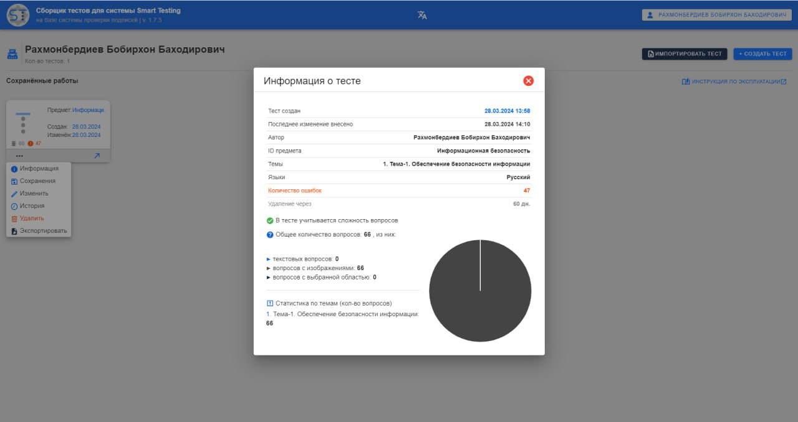
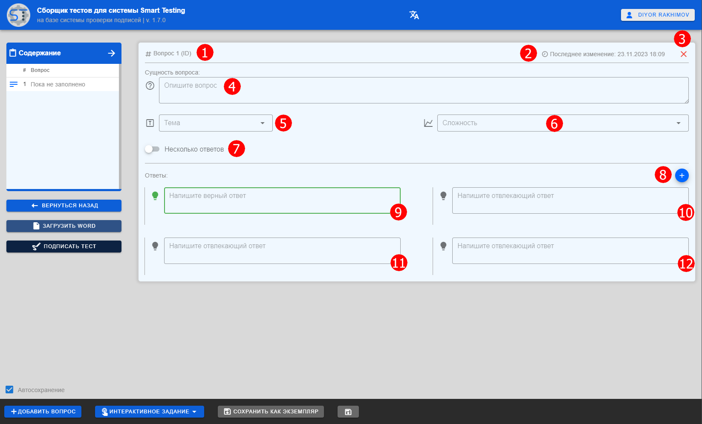

### st-composer

### Стек технологий
<div>
    
    
    
</div>

###
> Проект провальный. Рабочий, но очень плохо написанный. <strong>Идёт работа над над ST v.1.2</strong>

### Информация
**st-composer** - один из модулей системы SmartTesting. Представляет собой десктоп клиент, на котором пишуться тесты.
<div align="center">
    
    
</div>

#### Цифровая подпись
Авторы тестов перед входом загружают свою цифровую подпись (самодельная, json файл). Он необходим для того, чтобы ставить на тестах отметку авторства ииспользуется при шифровании тестов, а также в подписи храниться списки предметов и их тем.

Тесты в памяти (IndexedDB) хранятся в зашифрованном виде (AES256), а после подписания они шифруются с помощью RSA-256 и могут быть расшифрованы только на стороне [st-admin-server](https://github.com/rakhmight/st-admin-server)

<div align="center">
    
</div>

#### Тесты
Внутри клиента есть инструкция по составлению тестов.

Тесты можно писать на нескольких языках одновременно. При  этом появятся новые поля (вопросов и ответов) соответствующих языков (поле будет выделено флажком этого языка).

На данный момент возможно писать простые текстовые вопросы с несколькими вариантами ответов (мин. 4, макс. 6) + добавлять к ним изображения (как к вопросу, так и к каждому ответу). Также реализован один вид интерактивных заданий, где на изображении автор тестов отмечает область, которую экзаменуемому нужно будет найти.

Можно указывать несколько верных ответов.

Тесты возможно считать с word файла. Для этого нужно будет придерживаться специального синтаксиса:

<div align="center">
    
</div>

#### Копия экземпляра тестов
Есть возможность сохранять копию текущего состояния тестов, а позже откатывать их к этому состоянию.

#### Процесс подписания
Чтобы завершить работу над тестами их нужно подписать. Процесс подписание тестов запускает ряд проверок, из них:
- проверка на незаполненные поля;
- проверка на существование правильного ответа;
- проверка на невалидные знаки (� при загрузке word файла);
- проверка на одинаковые ответы в рамках одного вопроса;
- проверка на непропорциональные ответы по  длине в рамках одного вопроса (ответы по длине д.б. примерно одинаковыми, погрешность 120-символов);
- проверка на идентичные вопросы в тесте;
- проверка  на похожие вопросы в тесте (схожесть от 85%).

При подписании тесты шифруются с помощью асимметричного алгоритма шифрования RSA-256 (публичного ключа).\
Подписанный тест можно скачать в .json формате

### Сборка и запуск
- устанавливаем зависимости:
```bash
npm i
```

- собираем десктопную версию клиента:
```bash
npm run electron:build
```
###
> После завершения сборки установочный файл будет находиться в директории /dist_electron/bundled